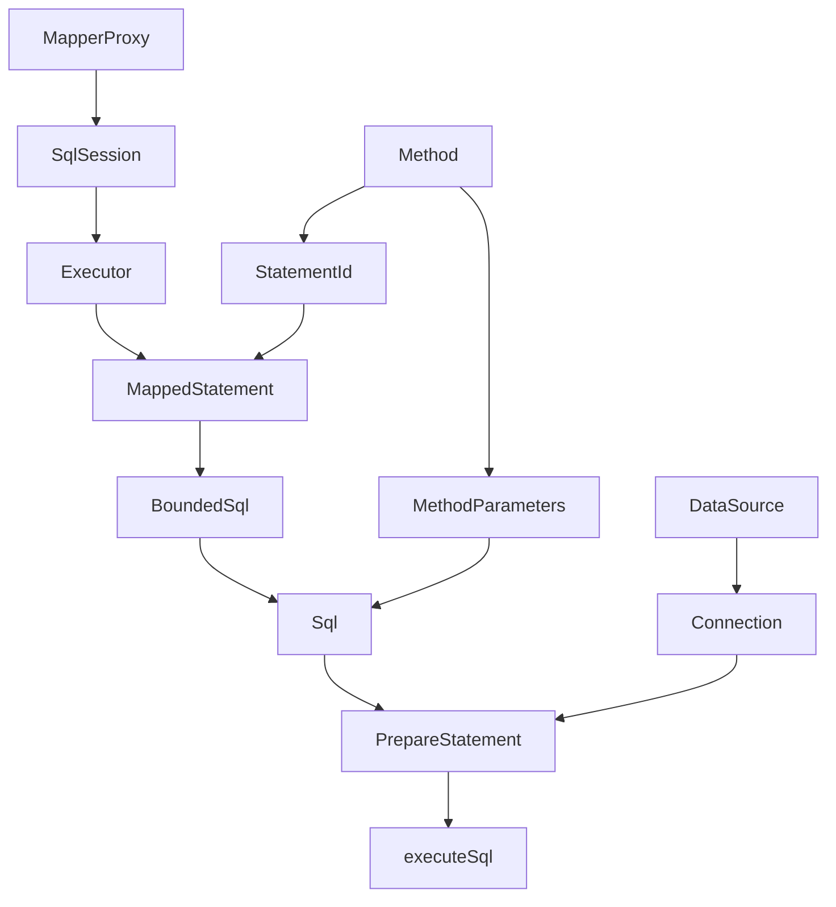

# 数据数据迁移其实主要就是垂直拆分和分库分表 垂直拆分和分库分表过程中主要数据库的操作就是双写和查询 我们会有开关来控制状态的转换，公司业务里orm主要是用mybatis
本文主要目的是为了减少代码的侵入性和迁移过程中数据库读写代码的可复用性，实际项目里单个表涉及的查询多达几十个，并且涉及到几十个文件的修改，为了减少迁移过程中对业务代码的修改，我文章下面会给一个样例(毕竟不能带上公司业务代码)。我目前在酷家乐工作中有遇到以下两个之前处理起来代码比较繁琐的地方

1、一个是大量的业务表从老的数据进行迁移(这里可能容易遇到自增主键切换写顺序一致性问题)，

2、还有一个问题就是部分大表的扩容(实际上相当于垂直拆分 然后分库) 本质上都是一回事情


### 进行迁移的话会需要采用dts或者数据库日志binlog同步存量数据的过程，这里根据自己公司的技术栈来选择 存量数据写入数据库的时候带上主键  
```sql
INSERT INTO tablename(field1,field2, field3, ...) 
VALUES(value1, value2, value3, ...) 
ON DUPLICATE KEY UPDATE 
field1=value1,field2=value2, field3=value3, ...;
```
## 写增量数据
1、通常做法是进行双写 写入老表的时候同时写入新表，如果需要的话可以加上手动事务管理，毕竟是跨库，不过实际应用场景中写入失败的情况很少，根据实际情况来决定。
2、双写逻辑会麻烦点的地方就是插入顺序切换时候的自增主键一致性问题。

## 自增主键插入的问题

#### (1) 老表如果是单表自增的，新表是单表自增的话
找流量低的时候切换读写顺序，如果业务需要高度一致性，加分布式锁，需要额外的开关来决定是否走有锁的逻辑，顺序切换以后，关闭那个控制是否走锁的逻辑的开关(如果条件允许 的话，各个服务器之间其实通过本地rocksDb写磁盘 实现一个分布式一致性算法比如于raft 也是可以的 实际上各个服务自己的集群就是一个小型的raft集群了) 其实这里也可以方法 (2)去解决，就是需要个过渡表来管理主键自增

#### (2) 老表如果是单表自增的，新表是分表的话
老表自增id 增加一个大区间比如原来是 id = 10^7 我们直接增加到 id = 2 * 10 ^ 7 新表设置自增id为 10^7 + delta( delta > 0 && delta < 10 ^ 4) 这个范围自己控制一下就好, 切换插入顺序以后主键不会冲突，也不会阻塞依赖业务方修改sql为rpc  迁移完成以后 新表主键改成 3 * 10 ^ 7, 这里只是大致数量, 实际区间大小由业务来决定
at
## 然后就是代码逻辑冗余问题了

这里其实稍微涉及到一点mybatis的架构，通常业务里面我们的mybatis的mapper对象本质上是MapperProxy这个类，套了层jdk动态代理而已，对于需要垂直拆分数据迁移表相关的mapper，我这边直接自己实现了一个代理，绕过MapperProxy，直接通过 SqlSession 去执行，但是我还是会实现一个 mapper类的代理对象去替换掉业务代码里面用到的mapper对象，从而实现基本无侵入性, 迁移完了以后代码还是需要改一下包名啥的

mybatis整体流程如下 tddl修改替换了　DataSource Connection 和 PrepareStatement 我的做法是替换掉MapperProxy



#### 改造如下 我这里以一个UserMapper为例
```
    @Primary
    @Bean
    public UserMapper delegateUserMapper(DbHandler dbHandler) {
        return (UserMapper) Proxy.newProxyInstance(UserMapper.class.getClassLoader(),
                new Class<?>[]{ UserMapper.class }, dbHandler);
    }
```
MapperHandler
```java
public class MapperHandler {

    private final MapperMethod.SqlCommand command;
    private final MapperMethod.MethodSignature methodSignature;

    public MapperHandler(Class<?> mapperInterface, Method method, Configuration config) {
        this.command = new MapperMethod.SqlCommand(config,
                mapperInterface, method);
        this.methodSignature = new MapperMethod.MethodSignature(config,
                mapperInterface, method);

    }

    public MapperMethod.MethodSignature getMethodSignature() {
        return methodSignature;
    }

    public Object execute(SqlSession sqlSession, Object[] args) {
        return execute(sqlSession, args, methodSignature.convertArgsToSqlCommandParam(args));
    }

   public Object execute(SqlSession sqlSession, Object[] args, Object param) {
        Object result;
        switch (command.getType()) {
        case INSERT: {
            result = rowCountResult(sqlSession.insert(command.getName(), param));
            break;
        }
        case UPDATE: {
            result = rowCountResult(sqlSession.update(command.getName(), param));
            break;
        }
        case DELETE: {
            result = rowCountResult(sqlSession.delete(command.getName(), param));
            break;
        }
        case SELECT:
            if (methodSignature.returnsVoid() && methodSignature.hasResultHandler()) {
                executeWithResultHandler(sqlSession, args, param);
                result = null;
            } else if (methodSignature.returnsMany()) {
                result = executeForMany(sqlSession, args, param);
            } else if (methodSignature.returnsMap()) {
                result = executeForMap(sqlSession, args, param);
            } else if (methodSignature.returnsCursor()) {
                result = executeForCursor(sqlSession, args, param);
            } else {
                result = sqlSession.selectOne(command.getName(), param);
            }
            break;
        case FLUSH:
            result = sqlSession.flushStatements();
            break;
        default:
            throw new BindingException("Unknown execution method for: " + command.getName());
        }
        if (result == null && methodSignature.getReturnType().isPrimitive() &&
                !methodSignature.returnsVoid()) {
            throw new BindingException("Mapper method '" + command.getName()
                    + " attempted to return null from a method with a primitive return type (" +
                    methodSignature.getReturnType() + ").");
        }
        return result;
    }

    private Object rowCountResult(int rowCount) {
        final Object result;
        if (methodSignature.returnsVoid()) {
            result = null;
        } else if (Integer.class.equals(methodSignature.getReturnType()) || Integer.TYPE.equals(
                methodSignature.getReturnType())) {
            result = rowCount;
        } else if (Long.class.equals(methodSignature.getReturnType()) || Long.TYPE.equals(
                methodSignature.getReturnType())) {
            result = (long) rowCount;
        } else if (Boolean.class.equals(methodSignature.getReturnType()) || Boolean.TYPE.equals(
                methodSignature.getReturnType())) {
            result = rowCount > 0;
        } else {
            throw new BindingException(
                    "Mapper method '" + command.getName() + "' has an unsupported return type: " +
                            methodSignature.getReturnType());
        }
        return result;
    }

    private void executeWithResultHandler(SqlSession sqlSession, Object[] args, Object param) {
        MappedStatement ms = sqlSession.getConfiguration().getMappedStatement(command.getName());
        if (void.class.equals(ms.getResultMaps().get(0).getType())) {
            throw new BindingException("method " + command.getName()
                    + " needs either a @ResultMap annotation, a @ResultType annotation,"
                    +
                    " or a resultType attribute in XML so a ResultHandler can be used as a parameter.");
        }
        if (methodSignature.hasRowBounds()) {
            RowBounds rowBounds = methodSignature.extractRowBounds(args);
            sqlSession.select(command.getName(), param, rowBounds,
                    methodSignature.extractResultHandler(args));
        } else {
            sqlSession.select(command.getName(), param, methodSignature.extractResultHandler(args));
        }
    }

    private <E> Object executeForMany(SqlSession sqlSession, Object[] args, Object param) {
        List<E> result;
        if (methodSignature.hasRowBounds()) {
            RowBounds rowBounds = methodSignature.extractRowBounds(args);
            result = sqlSession.<E>selectList(command.getName(), param, rowBounds);
        } else {
            result = sqlSession.<E>selectList(command.getName(), param);
        }
        // issue #510 Collections & arrays support
        if (!methodSignature.getReturnType().isAssignableFrom(result.getClass())) {
            if (methodSignature.getReturnType().isArray()) {
                return convertToArray(result);
            } else {
                return convertToDeclaredCollection(sqlSession.getConfiguration(), result);
            }
        }
        return result;
    }

    private <T> Cursor<T> executeForCursor(SqlSession sqlSession, Object[] args, Object param) {
        Cursor<T> result;
        if (methodSignature.hasRowBounds()) {
            RowBounds rowBounds = methodSignature.extractRowBounds(args);
            result = sqlSession.<T>selectCursor(command.getName(), param, rowBounds);
        } else {
            result = sqlSession.<T>selectCursor(command.getName(), param);
        }
        return result;
    }

    private <E> Object convertToDeclaredCollection(Configuration config, List<E> list) {
        Object collection = config.getObjectFactory().create(methodSignature.getReturnType());
        MetaObject metaObject = config.newMetaObject(collection);
        metaObject.addAll(list);
        return collection;
    }

    @SuppressWarnings("unchecked")
    private <E> Object convertToArray(List<E> list) {
        Class<?> arrayComponentType = methodSignature.getReturnType().getComponentType();
        Object array = Array.newInstance(arrayComponentType, list.size());
        if (arrayComponentType.isPrimitive()) {
            for (int i = 0; i < list.size(); i++) {
                Array.set(array, i, list.get(i));
            }
            return array;
        } else {
            return list.toArray((E[]) array);
        }
    }

    private <K, V> Map<K, V> executeForMap(SqlSession sqlSession, Object[] args, Object param) {
        Map<K, V> result;
        if (methodSignature.hasRowBounds()) {
            RowBounds rowBounds = methodSignature.extractRowBounds(args);
            result = sqlSession.<K, V>selectMap(command.getName(), param,
                    methodSignature.getMapKey(),
                    rowBounds);
        } else {
            result = sqlSession.<K, V>selectMap(command.getName(), param,
                    methodSignature.getMapKey());
        }
        return result;
    }
}
```

DbHandler 整体架构如下
```java
@Service
public class DbHandler implements InvocationHandler, BeanPostProcessor {

    private SqlSession mSrcSqlSession;

    private SqlSession mDestSqlSession;

    private ConcurrentHashMap<Method, MapperHandler> mMethodCache = new ConcurrentHashMap<>();

    @Autowired
    public void setProperties(
            @Qualifier("srcSqlSessionFactory") SqlSessionFactory srcSqlSessionFactory,
            @Qualifier("destSqlSessionFactory") SqlSessionFactory destSqlSessionFactory) {
    }


    @Override
    public Object invoke(final Object proxy, final Method method, final Object[] args)
            throws Throwable {
        /** 
         * 这里处理sql处理
         * 正常情况下不会有delete 这里进行异常判断 根据业务场景进行处理
         */
        return null;
    }

    /**
     * 这里如果是单表迁移 可以考虑整体加分布式锁，或者把主键自增的任务交给一个中间表
     * 移交完成以后 再由中间表移交给新表
     * @param args
     * @param oldHandler
     * @param newHandler
     * @return
     */
    private Object doInsert(Object[] args, MapperHandler oldHandler, MapperHandler newHandler) {
       
    }

    private Object doUpdate(Object[] args, MapperHandler oldHandler, MapperHandler newHandler) {
      
    }

    private Object doSelect(Object[] args, MapperHandler oldHandler, MapperHandler newHandler) {
        if (readNew()) {
            return newHandler.execute(mDestSqlSession, args);
        }
        return oldHandler.execute(mSrcSqlSession, args);
    }

    /**
     * 开关是否读新表
     * @return
     */
    private boolean readNew() {
        /**
         * TODO
         */
        return false;
    }

    /**
     * 开关写旧表
     * @return
     */
    private boolean writeOld() {
        /**
         * TODO
         */
        return true;
    }

    /**
     * 开关写新表
     * @return
     */
    private boolean writeNew() {
        /**
         * TODO
         */
        return true;
    }

    /**
     * 开关先插入新表
     * @return
     */
    private boolean insertNewFirst() {
        /**
         * TODO
         */
        return false;
    }

    private boolean partitionDb() {
        return false;
    }

    private int getSequenceId() {
        return 10000;
    }

    private String getStatementId(Method method) {
        return method.getDeclaringClass().getName() + "." + method.getName();
    }

    private MappedStatement getMappedStatement(Method method, String statementId,
           
    }


    private MapperHandler cachedMapperMethod(Method method, Class<?> clazz,
            Configuration configuration) {
     }
}

```
很多细节我这里暂时就先略去了，大家可以自己思考下怎么写，毕竟这个比较偏向业务，我这里 就是直接获取 sqlSession, 然后我们可以借助 MapperSignature这个内部类来完成mybatis的接下来的工作
下面这里给出一个 invoke和insert方法的简要实现 , 细节大家看下注释我用的是java8

```java
   @Override
    public Object invoke(final Object proxy, final Method method, final Object[] args)
            throws Throwable {
        /**
         * {@link Object#hashCode()} {@link #equals(Object)} 这些方法不做处理
         * interface default实现不做处理
         */
        if (Object.class.equals(method.getDeclaringClass()) || method.isDefault()) {
            return method.invoke(this, args);
        }
        Configuration configuration = mSrcSqlSession.getConfiguration();
        String statementId = getStatementId(method);
        MappedStatement mappedStatement = getMappedStatement(method, statementId, configuration);
        SqlCommandType sqlCommandType = mappedStatement.getSqlCommandType();
        MapperHandler oldMapperHandler = cachedMapperMethod(method, OldUserMapper.class,
                mSrcSqlSession.getConfiguration());
        MapperHandler newMapperHandler = cachedMapperMethod(method, NewUserMapper.class,
                mDestSqlSession.getConfiguration());

        if (SqlCommandType.INSERT.equals(sqlCommandType)) {
            return doInsert(args, oldMapperHandler, newMapperHandler);
        } else if (SqlCommandType.UPDATE.equals(sqlCommandType)) {
            return doUpdate(args, oldMapperHandler, newMapperHandler);
        } else if (SqlCommandType.SELECT.equals(sqlCommandType)) {
            return doSelect(args, oldMapperHandler, newMapperHandler);
        }
        /**
         * 正常情况下不会有delete 这里进行异常判断 根据业务场景进行处理
         */
        return null;
    }

    /**
     * 这里如果是单表迁移 可以考虑整体加分布式锁，或者把主键自增的任务交给一个中间表
     * 移交完成以后 再由中间表移交给新表
     * @param args
     * @param oldHandler
     * @param newHandler
     * @return
     */
    private Object doInsert(Object[] args, MapperHandler oldHandler, MapperHandler newHandler) {
        Object newRet, oldRet;
        boolean enableOld = writeOld();
        boolean enableNew = writeNew();
        if (enableOld && enableNew) {
            if (insertNewFirst()) {
                /**
                 * 如果是分库分表 我们从sequence里取出id
                 */
                if (partitionDb()) {
                    if (args[0] instanceof User) {
                        int id = getSequenceId();
                        ((User) args[0]).setUserId(id);
                    }
                }
                newRet = newHandler.execute(mDestSqlSession, args);
                oldRet = oldHandler.execute(mSrcSqlSession, args);
                /**
                 * 这里可以做比较
                 */
                return newRet;
            } else 「
                oldRet = oldHandler.execute(mSrcSqlSession, args);
                newRet = newHandler.execute(mDestSqlSession, args);
                /**
                 * 这里可以做比较
                 */
                return oldRet;
            }
        } else if (enableNew) {
            return newHandler.execute(mDestSqlSession, args);
        }
        return oldHandler.execute(mSrcSqlSession, args);
    }
```
mybatis xml插入的时候 判断下userId是否为null 是null就自增否则直接插入
```
<insert id="addUser" parameterType="com.qunhe.instdeco.partition.data.User" useGeneratedKeys="true">
        INSERT INTO user
        <trim prefix="(" suffix=")" suffixOverrides=",">
            <if test="user.userId != null">
                user_id,
            </if>
            <if test="user.name != null">
                username,
            </if>
            <if test="user.age != null">
                age,
            </if>
        </trim>
        VALUES
        <trim prefix="(" suffix=")" suffixOverrides=",">
            <if test="user.userId != null">
                #{user.userId},
            </if>
            <if test="user.name != null">
                #{user.name},
            </if>
            <if test="user.age != null">
                #{user.age},
            </if>
        </trim>
    </insert>
```
这样一来的话 原有的业务代码里面基本不需要我们自行修改代码，我这里其实还省略了很多的细节，酷家乐业务里面查询的时候如果是分库分表的话，对于分表键批量查询其实多的时候可以采用 ElasticSearch来查，这里就需要判断 分表键的参数的数量 需要 methodSignature去把 Object[] args转换为 ParamMap 其实就是一个hashMap大家自己去看下mybatis这部分源码就知道了.